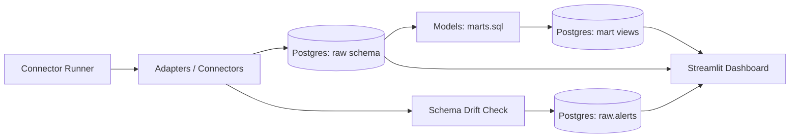

# Integration Observability Suite -- Connector Health

I started this project for one simple reason: **integrations don’t fail loudly**.

Most pipelines don’t “crash” — they *quietly rot*. A vendor rate-limits you. A field gets renamed. A payload shape drifts. Your job still “runs”… but your downstream data slowly turns into a fairytale.

So I built the thing I always wished existed when working with messy real-world integrations:

**A small, production-style observability layer for connectors** — log every run, detect schema drift, raise actionable alerts, and surface KPIs in one dashboard.

---

## What this project does

- **Runs connectors** (simulated connectors + an optional real public API connector)
- **Logs every run** into Postgres (`success/failed`, latency, attempts, rate-limited, error type)
- **Detects schema drift** (payload keys change → alert)
- **Dedupes alerts** (prevents spam)
- **Builds KPI marts** in Postgres for daily health metrics
- **Streamlit dashboard** to monitor runs, alerts, and KPIs
- **Automated CI smoke test** with GitHub Actions
- **Pytest suite** to keep behaviour stable

---

## Architecture (the mental model)



---
## Quickstart
### Prereqs

- **Docker Desktop**
- **Python 3.11+**

### Setup
```bash
# 1) Start Postgres
make up

# 2) Create DB schema/tables
make initdb

# 3) Run one cycle (writes runs + drift alert if triggered)
make run

# 4) Build KPI views (mart.*)
make marts

# 5) Open dashboard
make dash

```

Open: http://localhost:8501
### Reset Demo data
```bash
make reset
```
### Run tests
```bash
make test
```

---

## How it works (a bit more in depth)
### 1) Connectors & run logging

- Each connector returns a ConnectorResult containing:

- status (success / failed)

- payload (optional dict)

- latency_ms

- attempts

- rate_limited

- error_type, error_message (if failed)

Every run is inserted into:

- raw.connector_runs

This gives you a single source of truth for reliability: not opinions, not vibes — recorded evidence.

### 2) Schema drift detection

If a connector returns a payload:

- we store its key-set in raw.connector_schema

- if the next payload’s keys differ → we write a schema_drift alert into raw.alerts

This catches the most common “silent failure” in integrations: shape changes.

### 3) KPI marts (views)

The marts layer turns raw run logs into “ops metrics”:

- mart.connector_health_daily

  - total runs

  - success rate

  - average latency

  - average attempts

  - rate-limited rate

- mart.top_failure_reasons

  - counts failures grouped by error_type

### 4) Dashboard

The Streamlit app is intentionally simple:

- Latest runs

- Alerts

- Daily KPIs

- Top failure reasons

The goal is speed: “What broke? What changed? What do I do next?”

---

## Database tables (overview)

### raw

- raw.connector_runs — every run’s metadata

- raw.alerts — drift + health alerts

- raw.connector_schema — last-seen schema keys per connector

- raw.connector_attempts — (reserved for deeper per-attempt tracking)

### mart

- mart.connector_health_daily — daily rollups

- mart.top_failure_reasons — failure breakdowns

---

## Repo structure

- adapters/ — connectors (simulated + optional real API)

- orchestration/ — DB connection + run logging + runner

- checks/ — schema drift checks + alert logic

- models/ — marts SQL + runner to build views

- dashboards/ — Streamlit UI

- infra/ — docker-compose + SQL init/reset

- tests/ — pytest suite

---

## CI

GitHub Actions runs a smoke pipeline:

1. starts Postgres service

2. installs deps

3. initializes schema

4. runs pipeline a few times

5. builds marts

6. asserts expected rows/views exist

---

## Roadmap (where this can go next)

- Prefect scheduling / orchestration

- Per-attempt logging + backoff policy evaluation

- Connector “contracts” + quarantining payloads on drift

- Slack/Email alert integrations

- Baseline anomaly detection on latency/success rate

---

## Why this matters

Integrations are where “perfect systems” meet reality.

This repo is my answer to that reality:
measure reliability, detect silent breakage, and make the system observable — before it hurts users.
